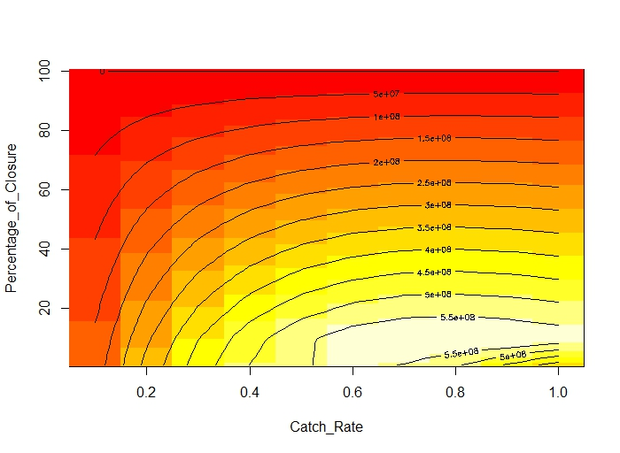

```{r setup, include=FALSE}
knitr::opts_chunk$set(echo = FALSE)
```

\DeclareMathSizes{10}{10}{7}{7}

## __Project Set Up__

- A 100 km^2^ TURF (Territorial Use Rights for Fishing), in a 10 by 10 km polygon. 

- The fishers have heard about an option to enhance the productivity and the income by closing fishing grounds within the TURF (i.e. a TURF-reserve).

- By having a no-take area, the TURF will benefit from the spillover (i.e. organisms that step out of the reserve).

- The community seeked consultation to find the optimum way in which they can maximize profits.


## __Strategies__

1) __Permanent closure__: Close a percentage of the TURF for the whole time of the concession and get benefits from spillover.

2) __Temporal closure__: Close a percentage of the TURF for $T*$ years, allowing the population to recover, then open the reserve and allow fish for a year before closing again.


## __Assumptions__

- The TURF is divided into parcels of 1 by 1 km.
- Each parcel of the concessioned area has a starting density of $$N_0 = \frac{K}{2}$$
- Movement wrapped at the edges of the TURF (Ovando *et al.*, 2016).
- Organisms are recruited once a year, with no age or size structure.
- Fishing effort outside the reserve is equal for every parcel.
- Price and costs are constant through time.


## __Equations__

$$N_{i,j,t+1} = N_{i,j,t} + N_{i,j,t}r\left(1-\left(\frac{N_{i,j,t}}{K}\right)\right) - U_{i,j,t} + M_{i,j,t} - E_{i,j,t}$$

Where:

$N_{i,j,t}$ = Number of extractable lobsters in parcel *i, j* at time *t*

$r$ =  Population growth rate

$K$ = Parcel carrying capacity

$U_{i,j,t}$ = Number of lobsters extracted from parcel *i, j* at time *t*

$M_{i,j,t}$ = Number of lobsters migrating into parcel *i, j* at time *t*

$E_{i,j,t}$ = Number of lobsters migrating out of parcel *i, j* at time *t*

***

$$U_{i,j,t} = uN_{i,j,t}$$

$$E_{i,j,t} = m\left((1-u_{i,j,t})N_{i,j,t}\right)$$

$$M_{i,j,t} = \left(\frac{m}{4}(1-u_{i,j,t})\right)(N_{i-1,j,t} + N_{i+1,j,t} + N_{i,j-1,t} + N_{i,j+1,t})$$

Where:

$u$ is the percentage of lobsters captured each year

$m$ is the percentage of the lobsters that move out of a parcel each year

***

$$C_t = \sum_{i=1}^{n} \sum_{j=1}^{n} u_{i,j,t}N_{i,j,t} =  \sum_{i=1}^{n} \sum_{j=1}^{n} U_{i,j,t}$$

$$R_t = C_tp-c$$

Where:

$C_t$ represents catches at time *t*

$R_t$ represents profits at time *t*

$p$ is equal to the price of a lobster

$c$ is the cost of fishing in a year


## __Data__

- Data from Quintana Roo provided by Comunidad y Biodiversidad A.C. (COBI).
- Data colected through transects inside the reserves.
- Parameters __*r*__ and __*K*__ were estimated optimizing model fit with solver.
$$N_{t+1}=N_t+rN_t\left(1-\frac{N_t}{K}\right)$$
- Parameters __*m*__, __*u*__, __*p*__ and __*c*__ were selected based on our knowledge.


## __Parameters__

- Growth rate ($r$) = 1.0834
- Carrying capacity ($K$) = 0.0532 organisms/m^2^
- Movement rate ($m$) = 0.5
- Catch rate ($u$) = 0.6
- Price ($p$) = US$ 20/lobster
- Cost ($c$) = US$ 730/year
- Discount rate ($d$) = 0.05


## Strategy 1 - Permanent Closure

<center></center>


## Strategy 2 - Temporal Closure

<center></center>


## Results

- Profit for Strategy 1 was US$ 575,771,357.

- Profit for Strategy 2 was US$ 558,079,331.

- In Strategy 1, the presence of a no-take area allows a even higher effort within the TURF. For $u$ = 0.8, the profit is US$ 599,599,248.

- In the other hand, if we increase the effort in Strategy 2, the profit would decrease to US$ 486,843,038.


## Conclusion

- You can make a good amount of money fishing lobster!

- No-take areas can maximize the profits of a fishery.

- You're better off living from the spillover of a no-take area than doing a rotation strategy and harvesting the entire TURF.


## Questions and Comments?


